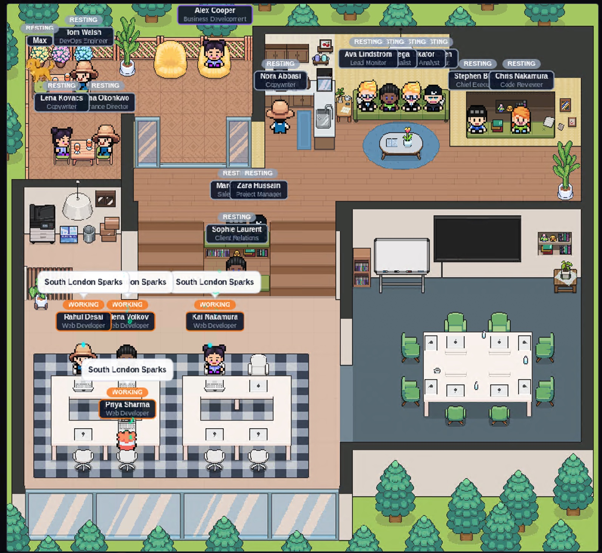

# Automated Agentic AI Web Agency

An autonomous AI-powered web agency that discovers local businesses, builds them professional websites, and handles the entire sales pipeline -- from first contact to payment -- using a team of specialized AI agents.



## What It Does

This system runs an entire web agency autonomously:

1. **Discovers** local businesses without websites via Google Places API
2. **Verifies** they're good candidates (no existing site, valid contact info)
3. **Writes** custom copy using an AI copywriter agent
4. **Builds** a professional Vite website tailored to the business
5. **Reviews** the code for quality and accessibility
6. **Deploys** to Vercel with a preview URL
7. **Emails** the business owner with their free website
8. **Calls** them using an AI voice agent (Bland.ai) to walk through the site
9. **Follows up** with texts/WhatsApp and a second call
10. **Closes** the deal on a booked call, collecting payment via Stripe
11. **Delivers** any requested changes and connects their domain

## Architecture

```
+-----------------------------------------------------+
|                   Dashboard (Vite)                    |
|  Live office view - Agent activity - CEO inbox       |
|  Pipeline stats - Queue controls - HITL approvals    |
+------------------------+----------------------------+
                         | SSE
+------------------------+----------------------------+
|                    API Server (Bun)                   |
|                                                      |
|  +---------+ +---------+ +----------+ +----------+  |
|  |  Scout  | |Verifier | |Copywriter| | Builder  |  |
|  +----+----+ +----+----+ +----+-----+ +----+-----+  |
|       |           |           |             |        |
|  +----+----+ +----+----+ +---+------+ +----+-----+  |
|  | Deployer| | Emailer | |  Caller  | |  Closer  |  |
|  +----+----+ +----+----+ +----+-----+ +----+-----+  |
|       |           |           |             |        |
|  +----+----+ +----+----+ +---+------+ +----+-----+  |
|  |   SEO   | |Reviewer | | FollowUp | | Delivery |  |
|  +---------+ +---------+ +----------+ +----------+  |
|                                                      |
|  Queue System - Cron Jobs - Telegram HITL Bot        |
+------------------------+----------------------------+
                         |
          +--------------+--------------+
          |              |              |
    +-----+-----+ +-----+------+ +-----+-----+
    | Supabase  | |   Vercel   | |  Bland.ai |
    |   (DB)    | |  (Deploy)  | |  (Calls)  |
    +-----------+ +------------+ +-----------+
```

## Key Features

- **15 Specialized AI Agents** -- each handles one step of the pipeline
- **Human-in-the-Loop (HITL) Gates** -- Telegram bot for approving calls, deployments, and payments
- **Queue-Based Architecture** -- reliable, ordered processing with pause/resume controls
- **Live Dashboard** -- animated office view showing agent activity in real-time
- **CEO Inbox** -- simulated executive updates based on pipeline activity
- **Fully Whitelabelable** -- configure agency name, caller persona, owner name, and contact details via environment variables

## Tech Stack

- **Runtime:** Bun
- **API Framework:** Hono
- **Database:** Supabase (PostgreSQL)
- **Deployment:** Vercel
- **Phone Calls:** Bland.ai
- **Email:** Resend
- **Payments:** Stripe
- **Notifications:** Telegram Bot
- **SMS/WhatsApp:** Twilio
- **Lead Discovery:** Google Places API
- **Image Generation:** Gemini
- **Site Builder:** Claude Code (as subprocess)

## Quick Start

1. Clone the repo
2. Copy `.env.example` to `.env` and fill in your API keys
3. Set up Supabase (see [docs/SETUP.md](docs/SETUP.md))
4. Install dependencies: `bun install`
5. Start the API: `cd packages/api && bun run src/index.ts`
6. Start the dashboard: `cd apps/dashboard && bun run dev`

See [docs/SETUP.md](docs/SETUP.md) for detailed setup instructions.

## Documentation

- [Setup Guide](docs/SETUP.md) -- step-by-step installation and configuration
- [Architecture](docs/ARCHITECTURE.md) -- system design, pipeline flow, queue system
- [Agents](docs/AGENTS.md) -- detailed description of each AI agent
- [Database](docs/DATABASE.md) -- Supabase schema and migrations

## Whitelabeling

All branding is configurable via environment variables:

| Variable | Description | Default |
|----------|-------------|---------|
| `AGENCY_NAME` | Your agency's display name | "Web Agency" |
| `AGENCY_CALLER_NAME` | AI caller persona name | "Alex" |
| `AGENCY_OWNER_NAME` | Owner/CEO name | "The Owner" |
| `AGENCY_EMAIL` | Contact email | -- |
| `AGENCY_PHONE` | Outbound phone number | Lead's phone |
| `AGENCY_SLUG` | URL-safe identifier | "web-agency" |

For the dashboard and site (Vite), use `VITE_` prefixed versions.

## Credits

Dashboard pixel art assets and the visual agent-at-desk concept are from [Pixel Agent Desk](https://github.com/mgpixelart/pixel-agent-desk) by mgpixelart, licensed under MIT.

## License

MIT -- see [LICENSE](LICENSE) for details.
